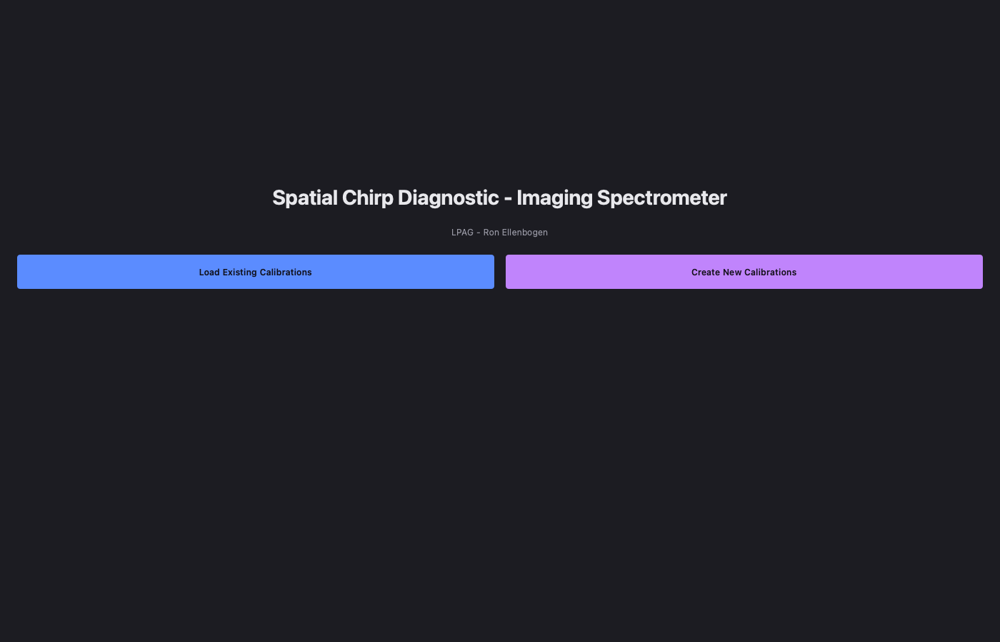
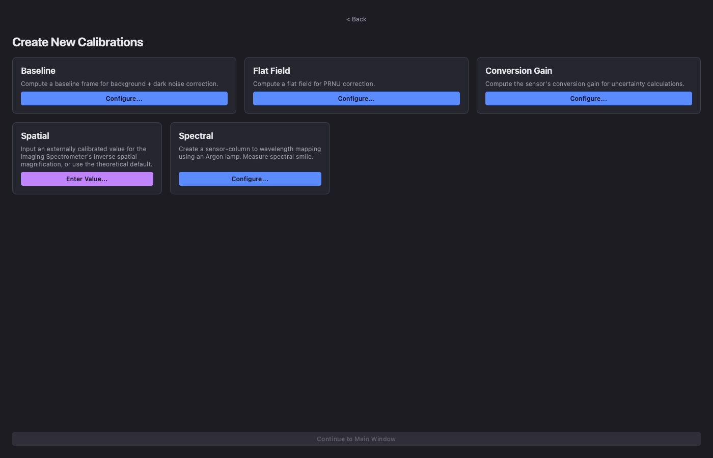
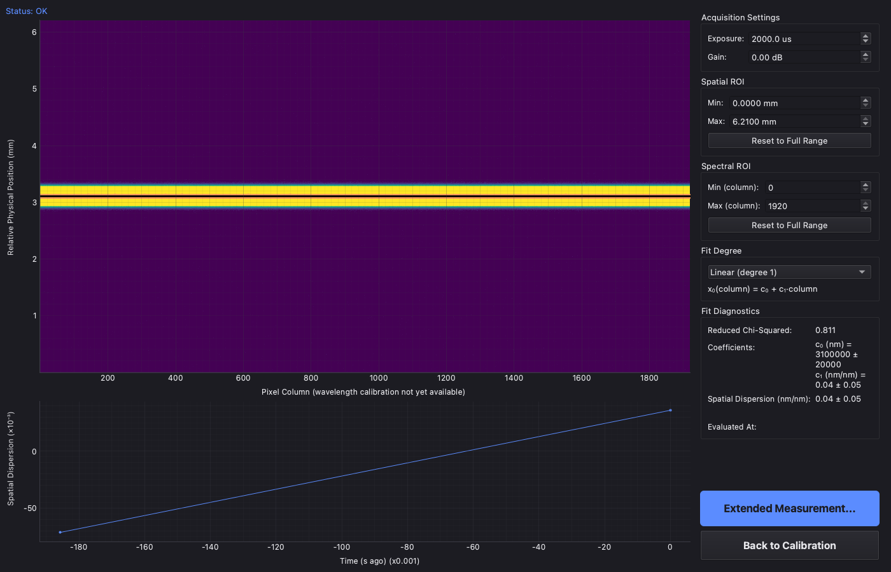
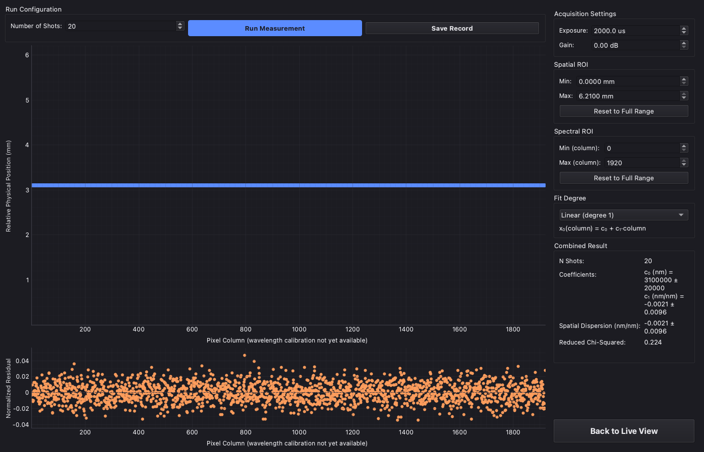

# Imaging-Spectrometer-Pipeline

## Overview

Ultrashort laser systems are susceptible to distortions that require careful monitoring. One such distortion is ***spatial chirp***, a correlation between optical frequency and transverse position across the laser beam.

As part of a summer research project in the ***Laser Plasma Accelerator Group (LPAG)*** at the University of Oxford, an imaging spectrometer was designed and built to detect and quantify spatial chirp in the group's Ti:sapphire laser system.

This repository contains the Python application developed for the instrument. The software acquires images from a camera, preprocesses and analyses the data to estimate spatial dispersion, and presents the results in real time through a graphical user interface.

---

## Objectives

- Acquire live data from the Imaging Spectrometer's camera
- Preprocess and clean the images
- Execute computations to estimate spatial dispersion
- Display results in a responsive GUI

---

## Screenshots

<p align="center">
  
  <br>
  <em>Welcome screen: the app's entry point, choosing between loading existing calibrations and
  creating new ones.</em>
</p>

<p align="center">
  
  <br>
  <em>Calibration screen: builds baseline, flat-field, conversion-gain, spatial, and spectral
  calibration artifacts before a session starts.</em>
</p>

<p align="center">
  
  <br>
  <em>Live view: real-time centroid/fit overlay, raw frame heatmap, and rolling spatial-dispersion trend
  (synthetic demo data — no wavelength calibration loaded).</em>
</p>

<p align="center">
  
  <br>
  <em>Extended measurement: a real 20-shot run, combining per-shot centroids into one fit with
  residuals and a combined-result summary.</em>
</p>

---


## Documentation

- [`docs/architecture.md`](docs/architecture.md) — how the software is put together: package layout,
  data flow, the canonical frame contract.
- [`docs/user_guide.md`](docs/user_guide.md) — how to install, calibrate, and run the instrument,
  through the GUI or the CLI.
- [`docs/presentation.pdf`](docs/presentation.pdf) — project presentation.

---

## Project Structure

```text
Imaging-Spectrometer-Pipeline/
├── README.md                 # Project overview and documentation
├── .gitignore                # Files and folders ignored by Git
├── LICENSE                   # Project license
├── pyproject.toml            # Project metadata, dependencies, and build configuration
│
├── docs/                     # Project documentation
│   ├── architecture.md       # System design and package layout
│   ├── user_guide.md         # Installation, calibration, and operating instructions
│   └── presentation.pdf      # Project presentation
│
├── configs/                  # Configuration files
│   └── default.yaml          # Camera settings, preprocessing defaults, spectrometer geometry
│
├── data/                     # Captured/processed data (raw frames, calibration artifacts, measurements)
│
├── assets/                   # Images and other static resources
│   └── images/
│
├── src/                      # Source code
│   └── pipeline/
│       ├── acquisition/      # Camera interface and frame acquisition
│       ├── preprocessing/    # Per-frame correction pipeline
│       ├── calibration/      # Building calibration artifacts (sensor, spatial, spectral)
│       ├── analysis/         # Centroiding and spatial-dispersion (ζ) estimation
│       ├── gui/              # Graphical user interface
│       ├── cli/              # Headless calibration CLI
│       └── utils/            # Shared utility functions
│
├── tests/                    # Unit and integration tests (synthetic backend, no hardware needed)
│
└── scripts/                  # Stand-alone calibration/diagnostic/demo scripts
```

---

## Installation

Clone the repository

```bash
git clone https://github.com/RonEllenbogen/Imaging-Spectrometer-Pipeline.git
```

Install dependencies

```bash
pip install -e .            # core: numpy, scipy, pyyaml, pypylon
pip install -e ".[gui]"     # + PySide6, pyqtgraph, for the GUI
pip install -e ".[dev]"     # + pytest, pytest-qt, for the test suite
```

Full hardware/environment setup (camera configuration, lab-PC specifics) is in
[`docs/user_guide.md`](docs/user_guide.md).

---

## Usage

```bash
python -m pipeline.main             # launch the GUI
python -m pipeline.cli.calibration  # headless calibration CLI
```

See [`docs/user_guide.md`](docs/user_guide.md) for the full calibration workflow and CLI reference.

---

## License

MIT License

---

## Acknowledgements

This project was developed as part of a summer research project in the Laser Plasma Accelerator Group (LPAG) at the University of Oxford.

Project supervisor: Dr Benjamin Greenwood.